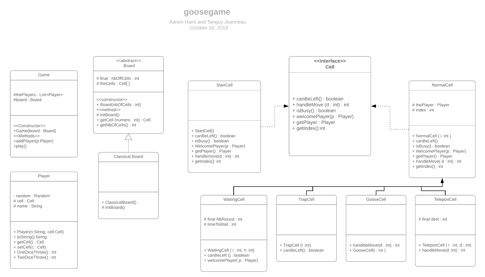

# Adrien HANS et Tanguy JEANNEAU
# Tp Jeu de l'oie : 

## Correction Q1 : 
Algorithme de la méthode play de la classe Game : 

TQ aucun joueur sur la case finale 
     &nbsp; joueur <- joueur suivant
     &nbsp; Si la cellule peut être quittée,alors  
    &nbsp; &nbsp; &nbsp; dé <- joueur joue
         &nbsp; &nbsp; &nbsp; arrivée <- trouve_la_cellule(dé, départ)
          &nbsp; &nbsp; &nbsp; Si arrivée est occupée, alors
            déplace l'occupant dans départ
 &nbsp; &nbsp; &nbsp; fin si
         &nbsp; &nbsp; &nbsp;Déplace joueur dans arrivée
     &nbsp; fin si 
 fin TQ 

## Q2 : 
Diagrammes UML dans le fichier `Java_UML_goosegame_HANS_JEANNEAU.png` ci-joint.

## Q3 : 
Code pour la classe abstraite dans le fichier `Board.java`
On propose un code pour une sous classe de board, `ClassicalBoard.java`, qui définit le plateau "classique" du jeu de l'oie. 

## Q4 : 
La case 0 est gérée par la sous-classe `StartCell` de la classe `Cell`. 
Elle définit les propriétés de la case 0, c'est-à-dire de la case départ, notamment en renvoyant toujours `True` pour canBeLeft() et ne renvoie rien pour WelcomePlayer(p : Player).

## Q5 : 
Le programme correspondant au jeu de l'oie et tel que décrit plus haut est joint à ce fichier.  

Par rapport à la version UML vue en classe, afin d'avoir une trace cohérente avec le sujet, les méthodes suivantes ont été ajoutées :  

- getBoard() dans Game, afin d'avoir accès au plateau en cours et surtout au nombre de cases de celui-ci (afin de vérfier que la case arrivée n'est pas dépassée par exemple).
- setTheCells(Cell[] cells) pour pouvoir contruire les cases du plateau.
- HandleMove dans WaitingCell et TrapCell pour pouvoir réaliser la trace voulue de la partie (cela évitait d'avoir à implémenter des ToString dans chaque Cell, et surtout de modifier la classe Cell elle-même).  

Certaines difficultés, notamment le fait de gérer le dépassement de la case arrivée suite au saut sur la case oie 54 avec un lancer de dés supérieur à 10, ont été résolus.  